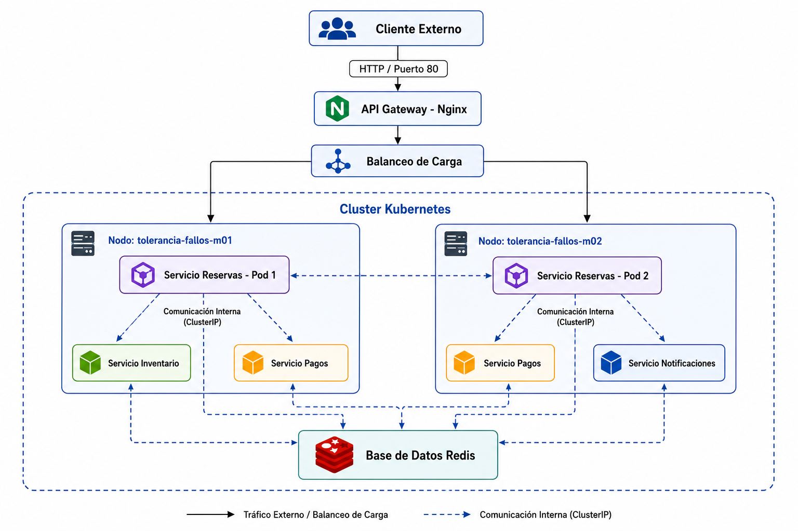

# 🛡️ Sistema de Reservas: Arquitectura de Microservicios con Tolerancia a Fallos

Este repositorio contiene la implementación de un sistema distribuido de reservas basado en microservicios, orquestado con Kubernetes. El diseño garantiza alta disponibilidad, protección contra picos de tráfico (Rate Limiting) y degradación elegante ante la pérdida parcial de servicios.

## 🏗️ Topología y Diagrama de Arquitectura

El clúster está configurado con 2 nodos virtuales para asegurar la resiliencia a nivel de hardware. El orquestador implementa reglas de Anti-Afinidad (PodAntiAffinity) para obligar a que las réplicas del servicio *Core* (Reservas) operen en hardware físicamente separado.



### Distribución de Componentes:
*   **API Gateway (Nginx):** Expuesto vía `NodePort` en el puerto 80. Implementa limitación de tasa estricta (1 req/sec) retornando HTTP 429 bajo ataques masivos.
*   **Servicio de Reservas:** 2 Réplicas aisladas por Anti-Afinidad en distintos nodos.
*   **Microservicios de Soporte:** Inventario, Pagos, Notificaciones (Red aislada interna tipo `ClusterIP`).
*   **Base de Datos (Redis):** Persistencia compartida y gestión de estado (Desplegada con imagen pública `redis:alpine`).
*   **Infraestructura:** Definida totalmente en los manifiestos YAML ubicados en la carpeta `/k8s`.

---

## 🚀 Instrucciones de Despliegue (Reproducción Local)

Para replicar el entorno de producción en un ambiente de Quality Assurance (QA) o Desarrollo, siga esta secuencia de comandos.

### 1. Requisitos Previos
*   Docker Desktop en ejecución.
*   Minikube CLI instalado.
*   Kubectl instalado.

### 2. Aprovisionamiento del Clúster
Se debe aprovisionar un clúster de dos nodos con recursos suficientes para el despliegue distribuido:
```bash
minikube start -p tolerancia-fallos --nodes 2 --cpus 4 --memory 4096
```

### 3. Construcción e Inyección de Imágenes
Construya las imágenes e inyéctelas directamente en el hipervisor de Minikube:
```bash
# Construcción de imágenes Docker
docker build -t gateway-app:latest ./api-gateway
docker build -t inventario-app:latest ./servicio-inventario
docker build -t notificaciones-app:latest ./servicio-notificaciones
docker build -t pagos-app:latest ./servicio-pagos
docker build -t reservas-app:latest ./servicio-reservas

# Carga masiva de imágenes al clúster Minikube
minikube -p tolerancia-fallos image load gateway-app:latest inventario-app:latest notificaciones-app:latest pagos-app:latest reservas-app:latest
```

### 4. Despliegue de Manifiestos Kubernetes
Aplique toda la infraestructura declarativa leyendo el directorio `k8s/`:
```bash
kubectl apply -f k8s/
```

### 5. Exposición del Sistema (Túnel de Red)
Para interactuar con el API Gateway desde el host, establezca el redireccionamiento:
```bash
kubectl port-forward svc/gateway-service 8080:80
```

---

## 🧪 Ejecución de Pruebas de Tolerancia a Fallos (QA)

Una vez establecido el túnel, puede lanzar las siguientes pruebas para validar los mecanismos de defensa del sistema:

**1. Prueba de Transacción Normal (HTTP 200):**
```bash
curl -X POST http://localhost:8080/reservas/comprar
```

**2. Prueba de Degradación Elegante (Caída de Notificaciones):**
Simule la destrucción del microservicio de notificaciones y lance una compra. El sistema debe responder con estado de notificación `Pendiente (Servicio caído)`.
```bash
kubectl scale deployment notificaciones-deployment --replicas=0
```

**3. Prueba de Seguridad Perimetral (Rate Limiting HTTP 429):**
Dispare un ataque de bucle (DDoS) para activar el mecanismo de defensa:
```powershell
# PowerShell
1..15 | ForEach-Object { curl.exe -s -w "\nHTTP Code: %{http_code}\n" -X POST http://localhost:8080/reservas/comprar }
```

**4. Caída Catastrófica de Hardware (Resiliencia de Nodos):**
Apague abruptamente el nodo secundario y lance una petición. Las peticiones deben seguir procesándose.
```bash
minikube node stop tolerancia-fallos-m02 -p tolerancia-fallos
```